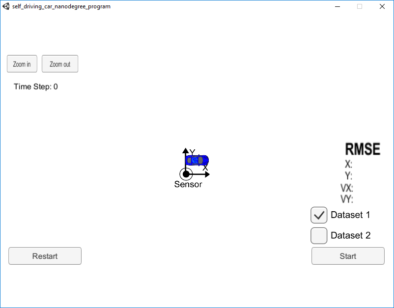
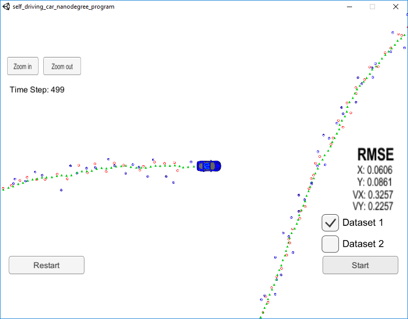
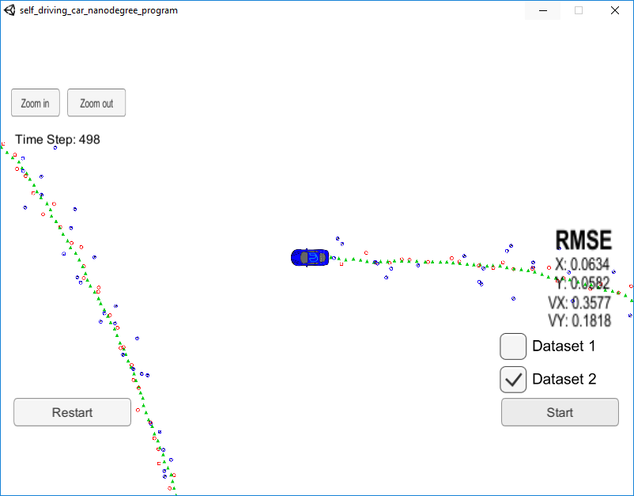

#**Unscented Kalman Filter**

## Introduction

This project aim to implement a Unscented Kalman Filter (UKF) to estimate the state of a moving object based on noisy lidar and radar measurements. This Udacity simulator used in this project can be downloaded [here](https://github.com/udacity/self-driving-car-sim/releases). The communication between UKF and simulator is based on [uWebSockets](https://github.com/uNetworking/uWebSockets).

## Basic Build Instructions
1. Clone this repo.
2. Make a build directory: `mkdir build && cd build`
3. Compile: `cmake .. && make` 
   * On windows, you may need to run: `cmake .. -G "Unix Makefiles" && make`
4. Run it: `./ExtendedKF `

## Results
### Dataset 1 ([click to video](https://youtu.be/20it1TFqoFo))

### Dataset 2 ([click to video](https://youtu.be/RXSG5oNu4gQ))
